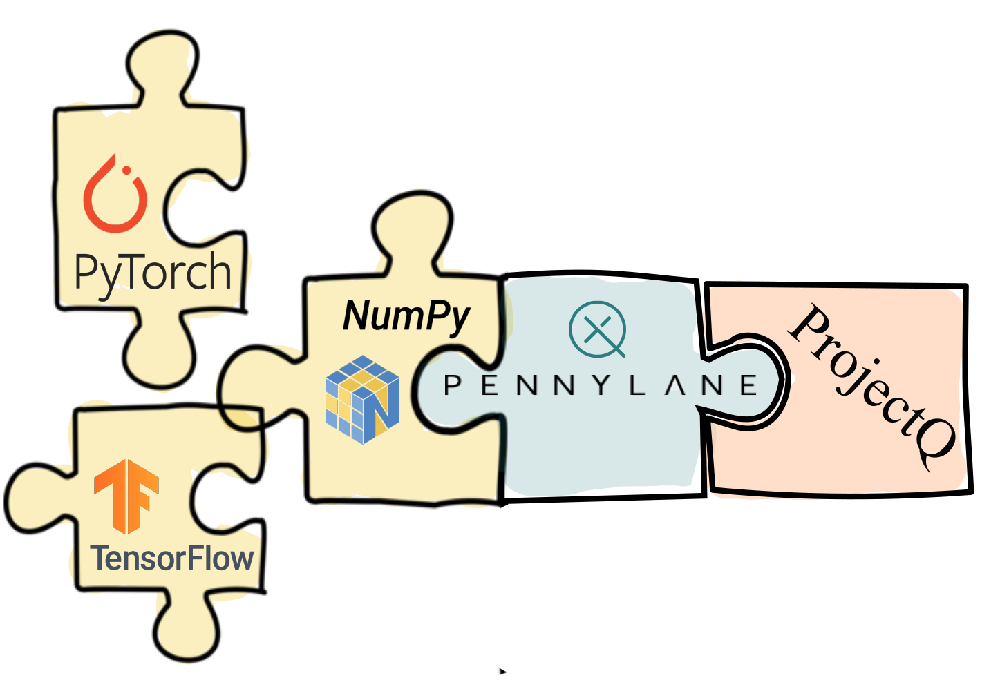

PennyLane-ProjectQ Plugin
#########################

:Release: |release|

|

.. include:: ../README.rst
  :start-after:	header-start-inclusion-marker-do-not-remove
  :end-before: header-end-inclusion-marker-do-not-remove

Once Pennylane-ProjectQ is installed, the provided ProjectQ devices can be accessed straight
away in PennyLane, without the need to import any additional packages.

Devices
~~~~~~~

PennyLane-ProjectQ provides three ProjectQ devices for PennyLane:

.. title-card::
    :name: 'projectq.simulator'
    :description: ProjectQ's basic simulator backend.
    :link: devices/simulator.html

.. title-card::
    :name: 'projectq.ibm'
    :description: ProjectQ's integration with the IBM Quantum Experience.
    :link: devices/ibm.html

.. title-card::
    :name: 'projectq.classical'
    :description: Simple simulator for classical computations.
    :link: devices/classical.html

.. raw:: html

        

         

Tutorials
~~~~~~~~~

To see the PennyLane-ProjectQ plugin in action, you can use any of the qubit based `demos
from the PennyLane documentation <https://pennylane.ai/qml/demonstrations.html>`_, for example
the tutorial on `qubit rotation <https://pennylane.ai/qml/demos/tutorial_qubit_rotation.html>`_,
and simply replace ``'default.qubit'`` with any of the available ProjectQ devices, such as ``'projectq.simulator'``:

.. code-block:: python

    dev = qml.device('projectq.simulator', wires=XXX)

You can also try to run tutorials, such as the qubit rotation tutorial, on actual quantum hardware by
using the ``'projectq.ibm'`` device.

.. toctree::
   :maxdepth: 2
   :titlesonly:
   :hidden:

   installation
   support

.. toctree::
   :maxdepth: 2
   :caption: Usage
   :hidden:

   devices/simulator
   devices/ibm
   devices/classical

.. toctree::
   :maxdepth: 1
   :caption: API
   :hidden:

   code
